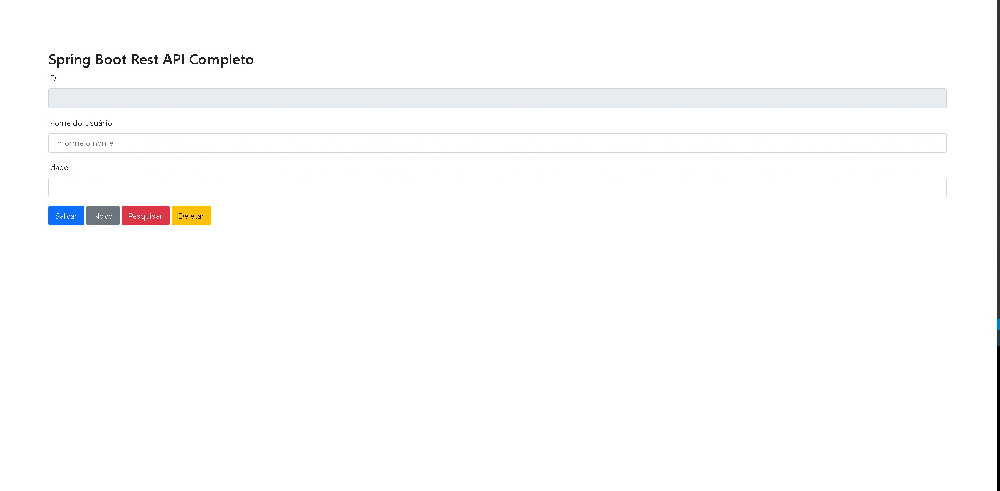

# CRUD-com-Spring-Boot-REST-API
CRUD com Spring Boot REST API

    

 
 <h1>CRUD Completo com Spring Boot REST API</h1>

  Esta aplicação tem o objetivo de reproduzir as funcionalidades de um CRUD(acrônimo para Create, Read, Update e Delete). Cadastro de usuario com id, nome e idade. 

<h2>Estrutura do Projeto</h2>

<ul>
   <li>
      <strong>src/main/java:</strong> Application.java.
      <strong>src/main/java/controllers:</strong> Greetings.controller.java.
      <strong>src/main/java/model:</strong> Usuario.java.
      <strong>src/main/java/respository:</strong> UsuarioRepository.java.
   </li>
  
   <li>
       <strong>src/main/resources/static:</strong> index.html.
   </li>
  
   <li>
       <strong>src/test/java/requests</strong> Greetings.controllerTest.java.
   </li>

   <li>
       <strong>Maven Dependencies</strong> Dependências Maven.
   </li>

   <li>
       <strong>target</strong> Arquivo jar.
   </li>
</ul>

<h2>Recomendações</h2>

  Para que a aplicação possa ser utlizada é recomendável baixar o repositório. 
  Instalar o PostgreSQL 9.5, Java JDK 17, Maven 3.8.5, Postman para testar as requisições(atualizar, deletar, listar, criar novo e buscar) e a IDE de sua preferência, no caso foi utilizada a Eclipse-Workspace. 

<h2>Ferramentas e tecnologias utilizadas</h2>
  

     
    
        
    
    
    
    
    
    
    
    
  

  
 <h2>Contate-me</h2>
  
 
    
    
     
    
    
  

<h2>Créditos</h2>

  O código-fonte foi baseado em exemplos e tutoriais disponíveis online.

## 🚀 Let's code! 🚀

